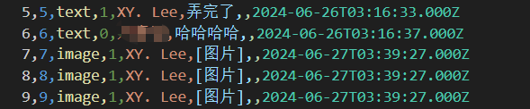

# little chatbot

## 介绍
这是一个基于python的聊天机器人训练框架，可以根据特定对话数据对LLM进行微调，使其能够展现出来对应对话中的风格  
运行这个项目只需要一个**8G的4060显卡**，在消费级游戏本上是完全可以运行的，而且**训练时间不会很长**，只需要十几分钟


## 使用指南
### 第一步：准备数据
你需要准备一个格式为csv的聊天数据（可以是从微信或者从QQ中导出的数据）格式如下
大概300条可用数据就可以（2500条对话记录处理之后大概会剩300条可用数据）

### 第二步：安装依赖
你需要执行如下的指令,来安装依赖的库
```python
python -m pip install -r requirements.txt
```
### 第三步：处理数据
你需要执行如下的指令,来处理数据
```python
python dataprocess.py
```
注意，利用这个指令处理数据后，会在data文件夹中生成一个jsonl文件，这个文件就是模型训练所需要的文件
你最好还要手动处理一下数据，删除掉一些不合适的对话记录，比如一些空对话记录，一些只有一个人说话的对话记录，一些包含一些隐私信息的对话记录等，最重要的是删除逻辑不同的对话记录。

### 第四步：训练模型
你需要执行如下的指令,来训练模型
```python
python train.py
```
### 第五步：运行模型
你需要执行如下的指令,来测试模型
执行过训练模型的指令后文件夹中总共会两个运行文件：1，chat.py 2，chatsft.py  
chat.py 是未经过训练的只加了系统提示词的聊天机器人，而chatsft.py 是经过对话数据sft训练过的聊天机器人。  
运行第一个聊天机器人的指令如下
```python
python chat.py
```
运行第二个聊天机器人的指令如下
```python
python chatsft.py
```

### UI界面
现已加上可以在本局域网访问的UI网页，只需执行一下命令
```python
python web_ui.py
```
打开网页之后会有一个登录界面，原始账户为：xiaoming 密码为：xm123456  
当然也可以在web_ui.py这个文件夹最后一行那里修改你的密码和账户  
注意浏览网页时时请保持程序运行，目前还不支持非本局域网设备访问该网站  
下面是进行访问的真实网址（如何找到这个网址的步骤，找到的这个网址可供统一局域网的所有设备访问）  
1. 保持这个终端不要关。  
2. 键盘按下 Win + R，输入 cmd 回车，打开系统的黑框框。  
3. 输入 ```ipconfig``` 回车。  
4. 找到类似 “IPv4 地址 . . . . . . . . . . . . : X.X.X.X” 这一行。  
5. 拿起你连着同一个 Wi-Fi 的手机，在手机浏览器里输入：
👉 http://X.X.X.X:7860 （把 X 换成你查到的真实数字，注意冒号是英文冒号）
如果只是想要在运行该程序的折别上访问，只需访问该地址：http://127.0.0.1:7860


